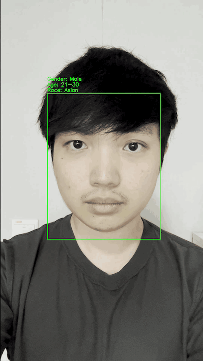
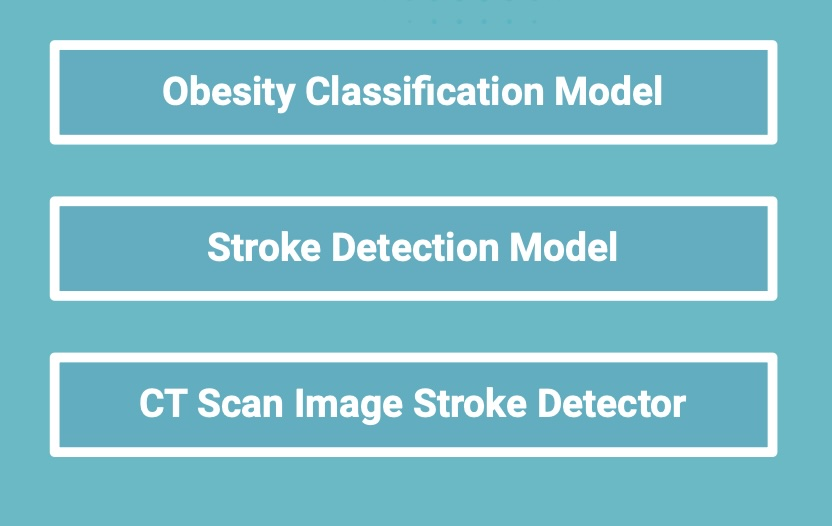
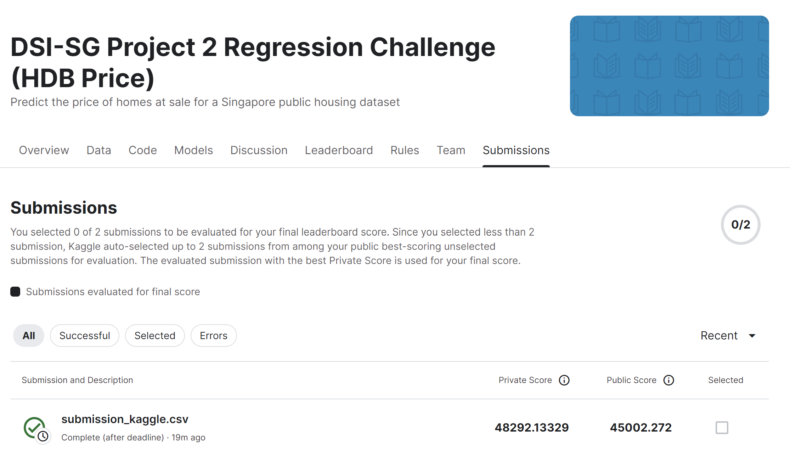
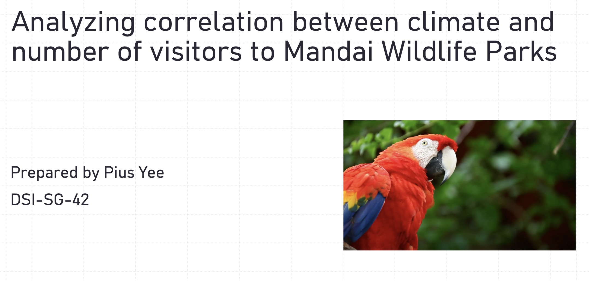

# Pius Yee's Projects (Data Science Immersive course  from General Assembly)

## 🌟  About Me

* Skilled in both financial analysis and data science, I am a Chartered Accountant (CA) of Singapore proficient in Python, machine learning, and SQL.
* With nearly 10 years of finance and accounting experience, including deep business analysis expertise, I'm upskilling in data science to expand my analytical capabilities and enhance my performance.
* Let's connect on LinkedIn: https://www.linkedin.com/in/piusyee/

## 🎯 Projects

* **[Capstone Project: Enhanced ATM Security using Facial Demographic Verification](https://github.com/piusyps/portfolio/tree/main/capstone)**
    * **Summary:** Develop a system using face detection models from ATM cameras to determine the gender, race, and age of the individual withdrawing cash.  Compare this with the cardholder profile, sending an SMS alert to the cardholder in case of a mismatch to prevent potential card misuse.

    * **Key Objectives:** Build an additional layer of security to protect ATM customers from card skimming.

    * **Technologies Used:** Python, Pandas, scikit-learn, Matplotlib, Convolutional Neural Network (CNN), Tensorflow Keras, MTCNN

    * **Link to project:** https://github.com/piusyps/portfolio/tree/main/capstone
    

     
    

* **[Project 4: Obesity and Stroke Model with CT Brain Scan](https://github.com/piusyps/portfolio/tree/main/project_4)**
    * **Summary:** Develop a streamlined system that leverages detailed patient information and machine learning models to improve stroke risk assessment – including obesity classification, stroke prediction based on patient data, and CT scan image analysis –  enabling physicians to proactively identify and treat high-risk patients.

    * **Key Objectives:** To empower A&E with a system for easier identification of patients at risk of stroke.

    * **Technologies Used:** Python, Pandas, scikit-learn (ML models like XGBoost, Random Forests etc), Matplotlib, Tensorflow Keras

    * **Link to project:** https://github.com/piusyps/portfolio/tree/main/project_4

    

     
    

* **[Project 3: Web APIs & NLP](https://github.com/piusyps/portfolio/tree/main/project_3)**
    * **Summary:** Developed a classification model to accurately classify posts and forums relevant to mothers by using webscraping and NLP.

    * **Key Objectives:** The Campaign Strategists struggle to consistently identify relevant online discussions about work-life balance and childcare due to the volume of social media and forum content. To enhance campaign targeting and optimize our reach, we developed a classification model that accurately identifies posts and forums relevant to mothers, allowing us to tailor our messaging for greater impact.

    * **Technologies Used:** Python, Pandas, PRAW API, NLTK (for stemming, tokenizing etc), TF-IDF, Naive Bayes

    * **Link to project:** https://github.com/piusyps/portfolio/tree/main/project_3

    

     
    

* **[Project 2: Model for Predicting House Prices](https://github.com/piusyps/portfolio/tree/main/project_2)**
    * **Summary:** Developed a model to predict the house prices based on the information like house type, location, floor level and etc.

    * **Key Objectives:** To help empowering the property agents to provide customers invaluable insights for making well-informed decisions on pricing of HDB houses.

    * **Technologies Used:** Python, Pandas, Seaborn, Matplotlib, scikit-learn, Linear Regression

    * **Link to project:** https://github.com/piusyps/portfolio/tree/main/project_2
     
        (Predicted result submitted to Kaggle challenge:)
    

     
    

* **[Project 1: Analyzing the Impact of Singapore's Weather on Attraction Visitor Numbers](https://github.com/piusyps/portfolio/tree/main/project_1)**
    * **Summary:** The project aims to investigate whether a correlation exists between historical climate data in Singapore and historical visitor numbers.

    * **Key Objectives:** If a strong correlation is found, the attraction operators could include weather forecasts to improve the accuracy of predictive models for visitor numbers.

    * **Technologies Used:** Python, Pandas, Seaborn, Matplotlib

    * **Link to project:** https://github.com/piusyps/portfolio/tree/main/project_1

    

     
    

## 💡 Contact

* E-mail: piusyps@gmail.com
* LinkedIn: https://www.linkedin.com/in/piusyee/

